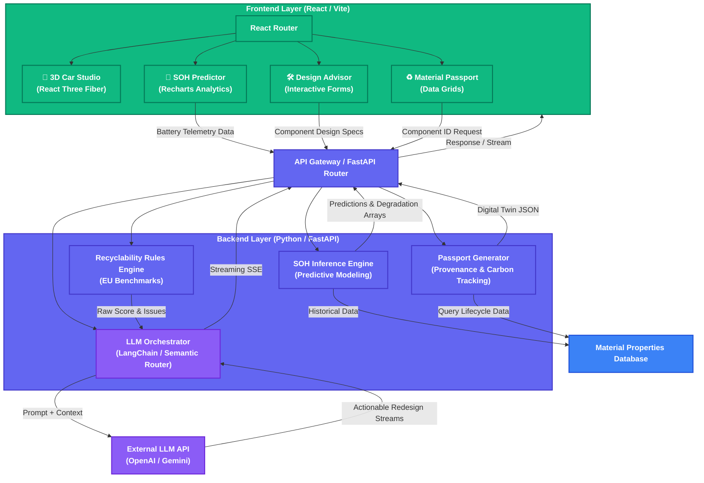

# CircularDrive AI

## Battery Second-Life + Material Passport Intelligence Platform

An **agentic AI platform** that predicts EV battery State of Health, assigns a second-life/recycling grade, generates a QR-based material passport, and recommends the safest, highest-value circular-economy pathway built with **LangGraph**, **MCP**, **A2A Protocol**, **AG-UI Protocol**, and **CopilotKit**.

---


## Architecture Diagram



### Layer Breakdown

1. **Frontend Layer (React + Vite)**
   - Uses `React Three Fiber` for high-performance 3D rendering (explodable battery models).
   - Uses `Recharts` for advanced analytics (MathWorks-style degradation curves and radar charts).
   - Consumes Server-Sent Events (SSE) to stream LLM responses in real-time.

2. **Backend Layer (FastAPI)**
   - **SOH Inference Engine**: Computes battery degradation matrices, internal resistance drops, and generates synthetic forecast data.
   - **Recyclability Rules Engine**: Evaluates JSON payloads of component properties against hardcoded EU battery regulations and material science heuristics.
   - **LLM Orchestrator**: Takes the deterministic outputs from the Rules Engine and passes them as context to a Large Language Model to generate human-readable, actionable redesign recommendations via an SSE stream.

3. **External Integrations**
   - **LLM API**: Powers the deep generative insights.
   - **Material Database**: Stores static lookup tables for material lifecycle carbon footprints, recovery rates, and market values.

---

## Protocol Integration

### MCP (Model Context Protocol)
All circularity intelligence tools are exposed as MCP-compatible tools via `mcp_server/server.py`. Any MCP client can discover and invoke:
- `predict_battery_soh` — ML-powered SOH prediction
- `grade_battery` — Second-life grading with safety overrides
- `generate_material_passport` — EU Reg 2023/1542 compliant passport
- `plan_recovery` — Disassembly sequence optimization
- `calculate_circularity` — Circularity score calculation
- `analyze_recyclability` — Design improvement suggestions

MCP Resources provide context: grading rules, material composition data.

### A2A (Agent-to-Agent Protocol)
Implements Google's A2A specification for inter-agent communication:
- **Agent Card** at `/.well-known/agent.json` — discovery endpoint with skills
- **Task Send** at `/a2a/tasks/send` — synchronous task processing
- **Task Subscribe** at `/a2a/tasks/sendSubscribe` — streaming SSE responses
- **Task Status** at `/a2a/tasks/{id}` — check task progress

Other AI agents can discover and interact with CircularDrive AI agents autonomously.

### AG-UI Protocol + CopilotKit
The AG-UI (Agent-User Interaction) protocol streams agent state to the frontend:
- **TEXT_MESSAGE** events — streaming text responses
- **TOOL_CALL** events — real-time tool invocation visibility
- **STATE_SNAPSHOT/DELTA** — agent state synchronization
- **RUN lifecycle** events — start/finish tracking

CopilotKit implements AG-UI natively and provides:
- `CopilotSidebar` — conversational AI assistant panel
- `useCopilotAction` — frontend actions invokable by the agent
- `useCopilotReadable` — state shared with the agent

### LangGraph + LangChain
- **LangGraph ReAct Agent** — multi-step reasoning with tool use
- **LangChain tools** — `@tool` decorated functions wrapping ML models
- **Streaming** — real-time token streaming via CopilotKit runtime
- **Fallback** — works without OpenAI API key using direct tool execution

---

## Key Features

1. **Battery SOH Prediction** — XGBoost/GradientBoosting ML model with SHAP explainability
2. **Second-Life Grading** — A/B/C/D grades with safety override rules
3. **Material Passport** — EU Regulation 2023/1542 compliant with QR code
4. **Disassembly Optimizer** — Step-by-step recovery with carbon/economic analysis
5. **Circularity Scoring** — Multi-factor score (0-100)
6. **Design Recyclability** — Improvement suggestions with scoring
7. **AI Copilot** — Open-ended conversational interface via CopilotKit
8. **Agent Interoperability** — A2A protocol for agent-to-agent communication

---

## How to Run

### Prerequisites
- Python 3.10+
- Node.js 18+
- (Optional) OpenAI API key for LLM-powered agent

### Backend

```bash
git clone https://github.com/raj713335/CircuVolt_AI
cd CircuVolt_AI
pip install -r requirements.txt

# Optional: set OpenAI key for full agent capabilities
cp .env.example .env
# Edit .env and add your OPENAI_API_KEY

python main.py
```

- API: `http://localhost:8000`
- Docs: `http://localhost:8000/docs`
- Agent Card: `http://localhost:8000/.well-known/agent.json`

### MCP Server (standalone)

```bash
cd CircuVolt_AI
python mcp_server/server.py
```

### Frontend

```bash
git clone https://github.com/raj713335/CircuVolt_AI_UI
cd CircuVolt_AI_UI
npm install
npm run dev
```

- App: `http://localhost:5173`

---

## API Endpoints

| Method | Endpoint | Protocol | Description |
|--------|----------|----------|-------------|
| POST | `/copilotkit` | AG-UI | CopilotKit streaming endpoint |
| GET | `/.well-known/agent.json` | A2A | Agent discovery card |
| POST | `/a2a/tasks/send` | A2A | Send task to agent |
| POST | `/a2a/tasks/sendSubscribe` | A2A | Send task with SSE streaming |
| GET | `/a2a/tasks/{id}` | A2A | Get task status |
| POST | `/predict-soh` | REST | Predict battery SOH |
| POST | `/generate-passport` | REST | Generate material passport |
| GET | `/passport/{component_id}` | REST | Retrieve passport |
| POST | `/recommend-recovery` | REST | Get recovery plan |
| POST | `/calculate-circularity-score` | REST | Calculate circularity |
| POST | `/design-recyclability-suggestions` | REST | Design analysis |
| GET | `/sample-batteries` | REST | Demo battery data |

---

## Tech Stack

| Layer | Technology |
|-------|-----------|
| Agent Framework | LangGraph (ReAct pattern) |
| LLM Orchestration | LangChain + LangChain-OpenAI |
| Tool Protocol | MCP (Model Context Protocol) |
| Agent Communication | A2A (Google Agent-to-Agent Protocol) |
| UI Protocol | AG-UI (via CopilotKit) |
| Frontend | React, Vite, Tailwind CSS, CopilotKit, Recharts |
| Backend | FastAPI, Python |
| ML | Scikit-learn, GradientBoosting, NumPy, Pandas |
| Database | SQLite (SQLAlchemy ORM) |
| QR Generation | Python qrcode library |

---

## Demo Flow

1. Open the app → Dashboard with architecture overview
2. Click chat icon → AI Copilot opens (CopilotKit sidebar)
3. Ask: *"Predict SOH for a battery with 1200 cycles, 65mΩ resistance"*
4. Agent uses LangGraph → calls `predict_battery_soh` tool → streams result
5. Navigate to the Passport tab → Generate QR-based material passport
6. Navigate to Recovery → View disassembly plan + carbon impact
7. Ask Copilot: *"Why is this battery not suitable for a second life?"*
8. Agent explains using grading rules from MCP resources


